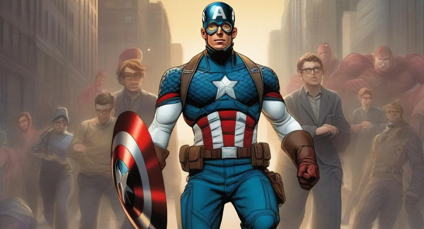
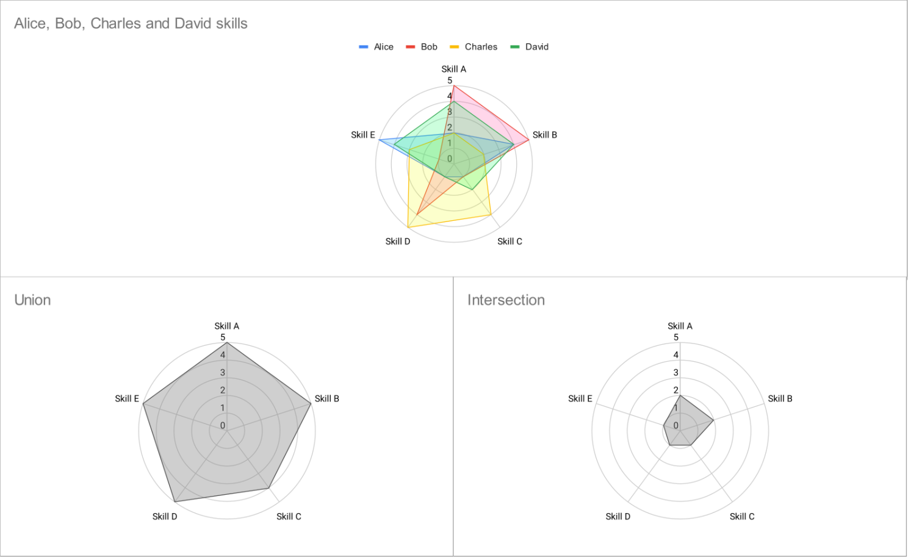

  

# The superhero guide to leadership

I might start a Civil War here (Marvel pun intended), but I believe *The Avengers* is a more compelling team than the *Justice League*.

One might argue that the Justice League has stronger members, and it is true. After all, they have Superman, Martian Manhunter, Wonder Woman, Green Lantern, Cyborg... Any of these superheroes is a powerhouse on their own right. But they all share similar abilities: super strength, super speed, flight (the invisible jet is back!), some form of energy projection, etc.

The Avengers, on the other hand, are made up of individuals who are less well rounded overall. Hulk? Incredibly strong but not the sharpest tool in the shed. Thor? More or less as strong as Hulk but depends on Mjolnir for some of his abilities like flying. Iron Man? A super genius with incredible wealth and an alcoholism problem. Hawkeye? Like Green Arrow, but broke. Captain America? A goody-two-shoes bloke on steroids. Ant-Man? A guy who can change size and make everybody cringe about the mass conservation inconsistencies depending on the needs of the script. Good old Spidey? Give him a break, he has enough problems paying rent and not getting dumped by his girlfriend.

[*Yes, I know that over the years dozens of different heroes have joined and left both teams. Some are very overpowered like Captain Marvel, Hyperion, or Sentry for the Avengers, and some more street-level for the Justice League such as Black Canary, Green Arrow or even The Batman himself... But you get my point*]

So, why are The Avengers "better"? Because when they come together, they complement each other, leaving no gaps.

But that is not always the case. In the comics and movies, in many occasions, Tony Stark's ego, Thor's godly hubris, or Hulk's rampages can fracture the team. When that happens, their foes can easily take them down one by one, exploiting each individual's weaknesses. And it is at these times when the least impressive Avengers, like Steve Rogers, Clint Barton, or Natasha Romanov, step in and act as the glue that keeps the team together.

How does this translate to our work life?

In real life it's challenging to find someone who is virtually perfect, like Superman, let alone a group of them. Our colleagues are likely to have their own flaws, but they will excel in certain areas, much like Tony Stark.

As leaders, it is our job to create an environment that allows the team to perform as the union of everyone's skills, rather than the intersection. Depending on how well you do, the aggregate performance of your team might look more like the graph on the bottom left or the bottom right (most of the time, something in between):

That is why leading a homogeneous team is easy. If there is a lot of overlap between the skill sets of your team members, the resulting shape is very similar whether it is the union or the intersection of their skill sets.

However, in a diverse team leadership can make or break. You can either have a team that is much better than any individual, or a chimera that is unable to operate effectively due to constant internal friction.

This means you don't have to be Superman. You don't even have to be a superstar genius like Tony Stark. You need to be like Captain America, the reliable backbone of the team. Your superpowers must be humility, fairness, compassion, and trustworthiness (actually, this means you can be Wonder Woman too if you so prefer!).

Your role is to identify your team members' strongest suits and distribute the workload accordingly. To mediate when there is conflict. To rally the team when morale is down. To point in the right direction when they are lost.

Exactly what Cap does in the [Battle of New York](https://www.youtube.com/watch?v=uk9id1KIjns) :)
