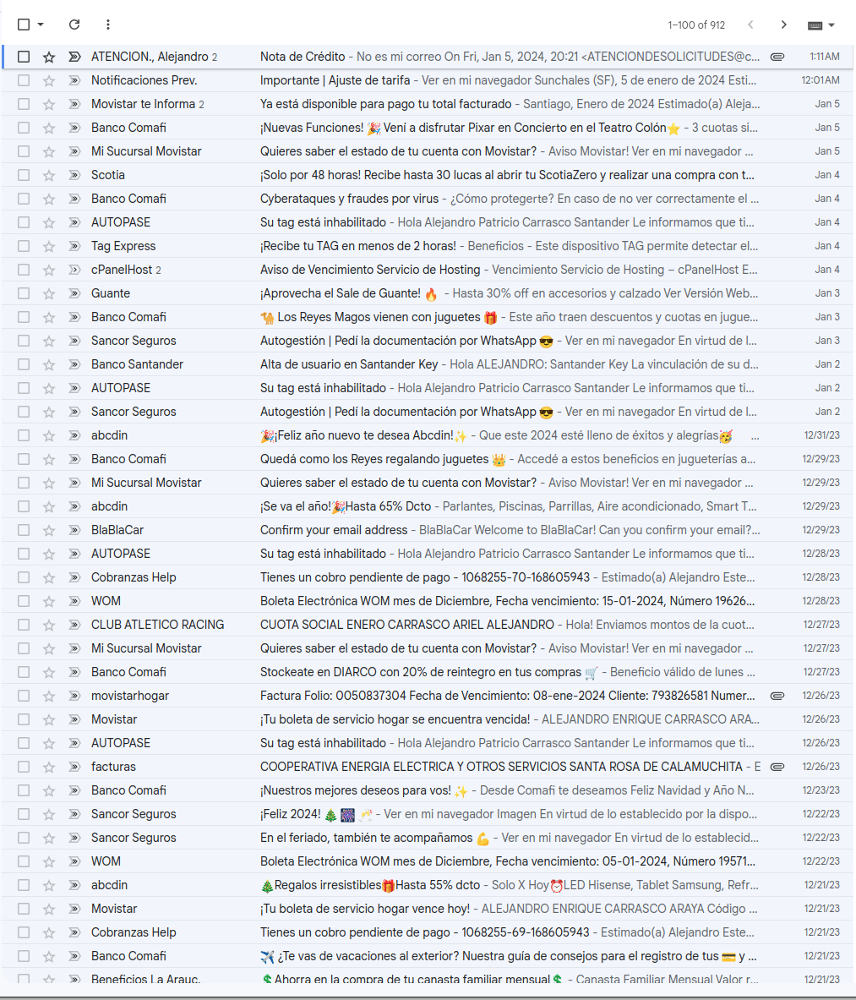

# The problem with email subscriptions

Long rant incoming!

## Background

If you have a relatively common name (like I do), and you happened to be fast enough securing a nice email address from a popular email provider (like I did), you might be familiar with this problem: **random people with a similar name will mistakenly provide *your* email address instead of theirs**.

If you are lucky enough to have an unusual name/last name combination, or couldn't get an easy to remember email address, you might think that this seldom happens and it is not a big deal... But believe me, I have a tag on my Gmail account with thousands of emails that weren't for me (I trash them from time to time).

Here is a small sample of the current contents for that tag:

And it is not always the same person; there are **hundreds of different people** making the same mistake. How do I know that? Because in the emails I receive, there is usually a reference to their full names, and they rarely repeat themselves... Sometimes they are not even named Alejandro at all!

## Frustration builds up

Years ago, I used to be civic and would try to inform the sender of the situation, but it **never** worked. I would keep receiving emails from that person/organization, and sometimes I even got messages of disbelief, accusing me of trying to pull their legs.

The worst cases are banks. They always include the classic footer in a stern tone, commanding you to report if you received a message that wasn't for you. Like this very real one from *Santander*:

> This message is private and confidential and it is intended exclusively for the addressee. If you receive this message by mistake, you should not disseminate, distribute or copy this e-mail. **Please inform the sender** and delete the message and attachments from your system. No confidentiality nor any privilege regarding the information is waived or lost by any mistransmission or malfunction.

Can you guess what the sender of that message was? Yes: `noreply@bancosantander.es`.

I once tried to go the extra mile, searched the support email address (this time for *BBVA*), and sent them a message explaining that I was getting emails with financial information that weren't for me.

Can you guess what their response was?

> (...) please provide your user name or account number (...)

I literally told them that I wasn't their client. Banks must be some of the dumbest organizations in the world.

## Living with it

For most cases, either because of malice or incompetence, the automatic *unsubscribe* does not work.

Marking the messages as spam does not work either because the emails are coming from trusted sources like international banks or utility companies.

So I had to make custom rules. A very coarse one is that anything I get from a `.cl` email address is junk. The ratio of people that can't type their email correctly in Chile is outstanding. I hope I never have to make business there.

Sometimes, if I am feeling frisky, I might even troll a little bit... I discovered that replying with something shocking is usually the best way for people to stop emailing you!

## The solution

Emails with confirmation links only solve half of the problem. In my case, I would still get the occasional "please confirm your email" message, but for the other people that enter a wrong email by mistake, it does not provide any kind of protection (if I was an evil agent, I would click on the confirmation emails to hijack their mailing!)

The solution is so simple that I wonder why no one has implemented it: Rather than entering an email address in the registration form, the user is provided with a unique secret key. In order to activate their subscription, **they have to send an email from their own email address to the organization**, using the key that was provided earlier in the body of the email as proof of identity.

There is even a bonus benefit here: as you have sent an email to the subscription service address, incoming emails won't be mistakenly flagged as spam.

The European Union could have legislated this in the GDPR, but instead, we got annoying pop-ups about cookies. Thanks guys!
