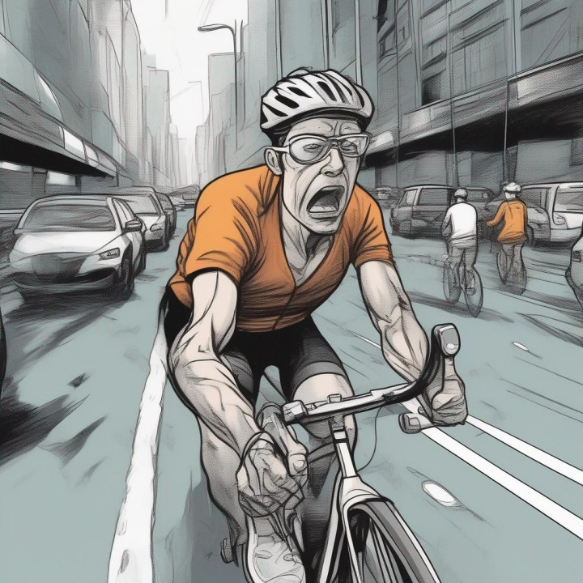
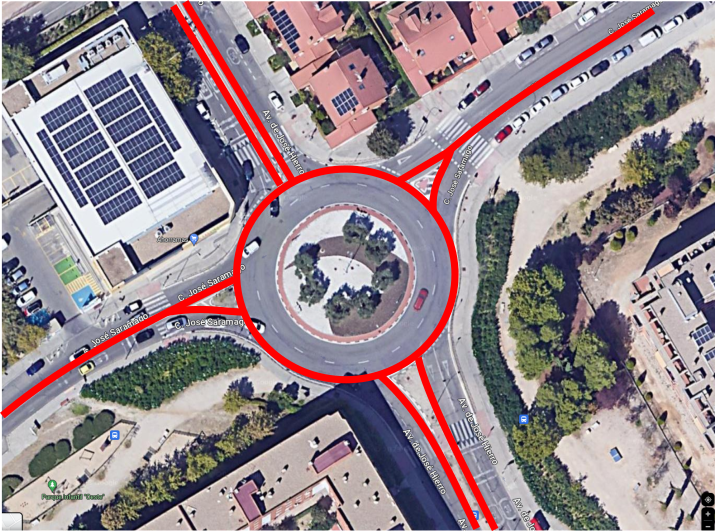
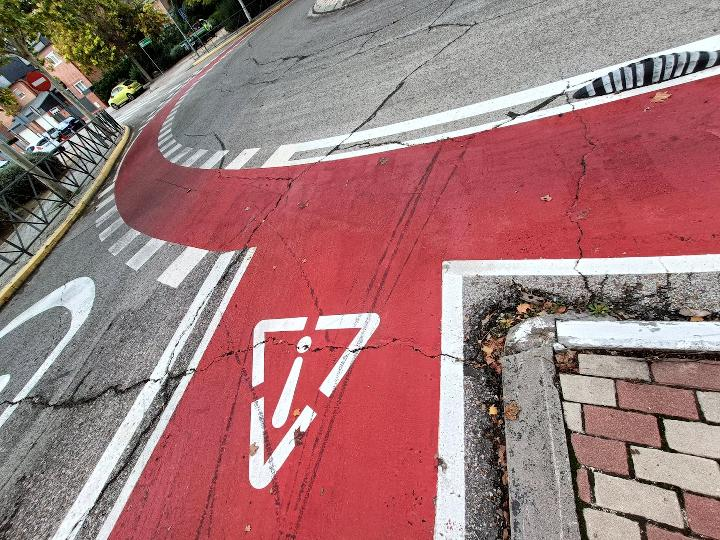
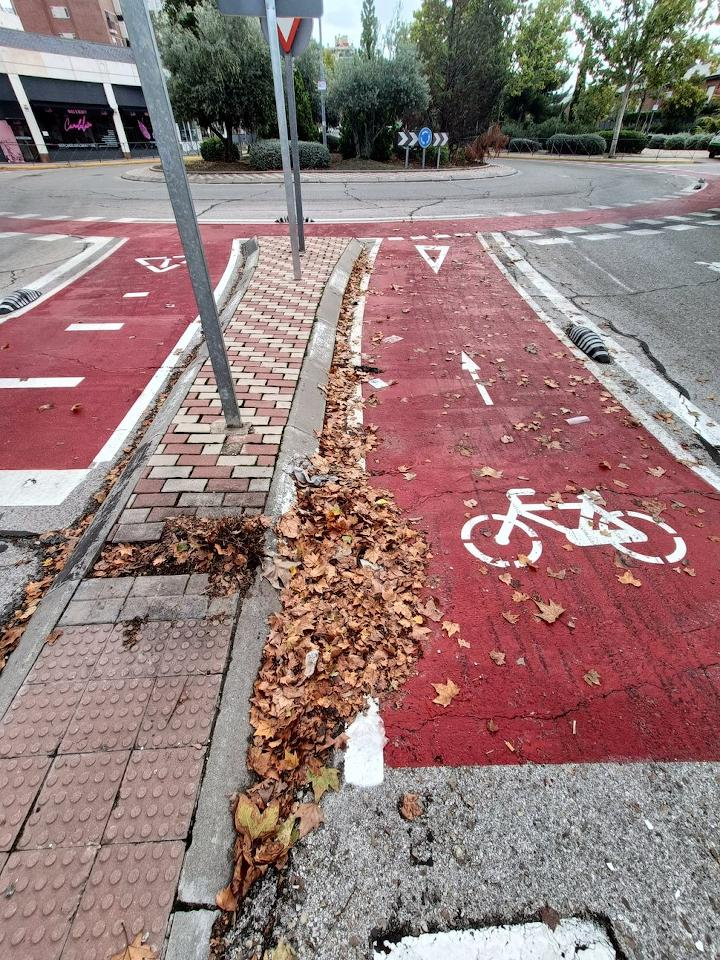
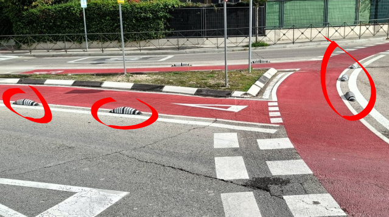
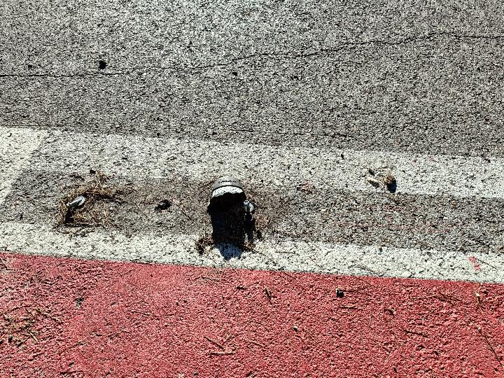
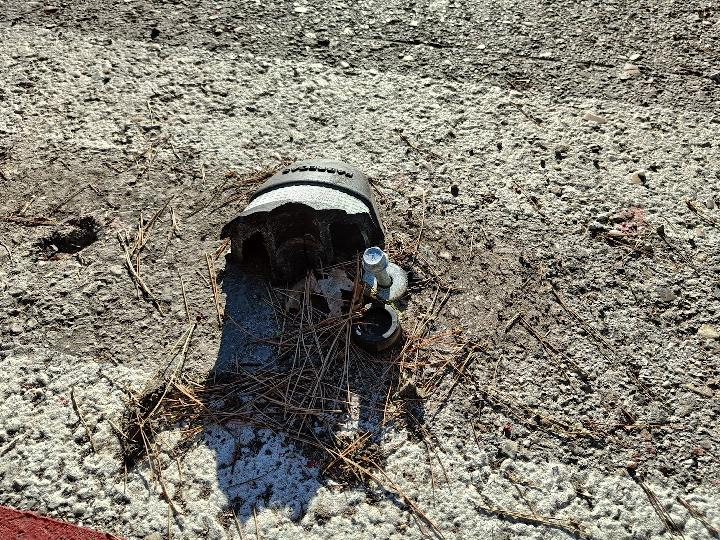
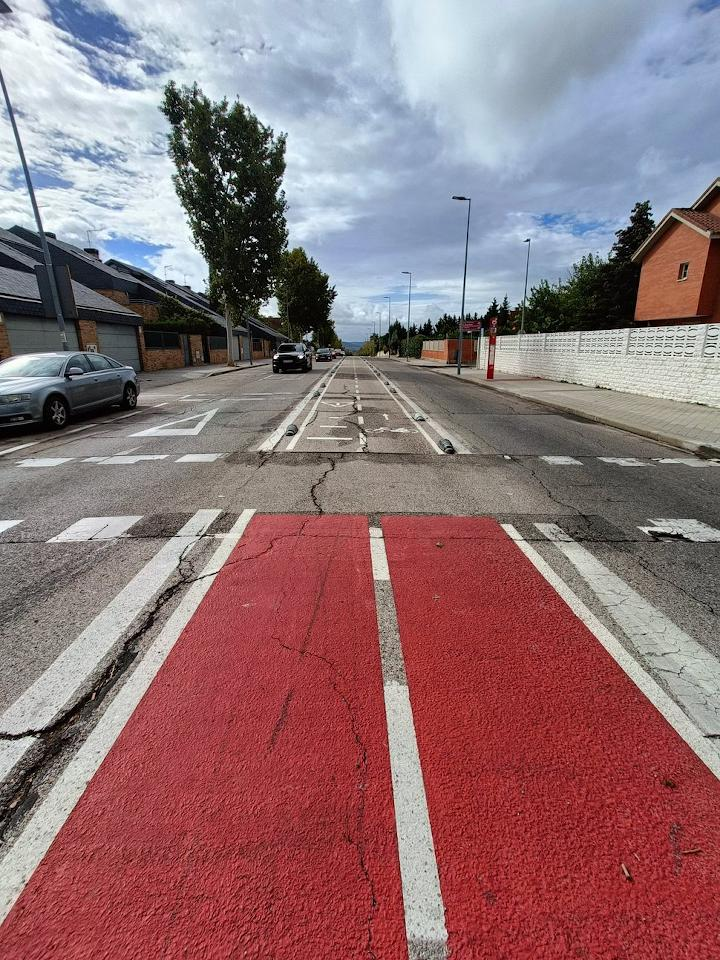
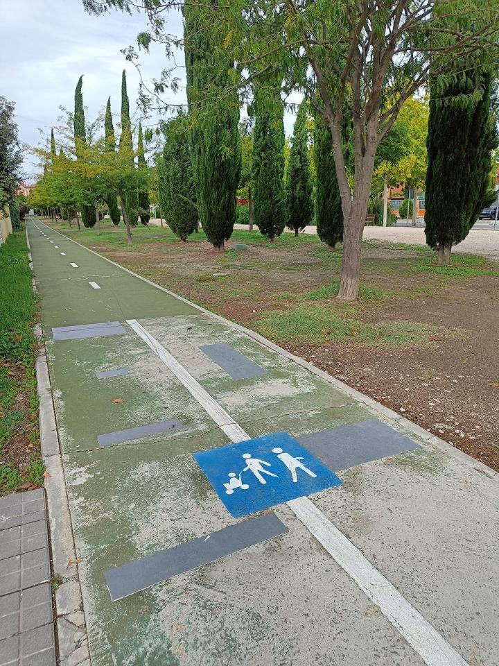
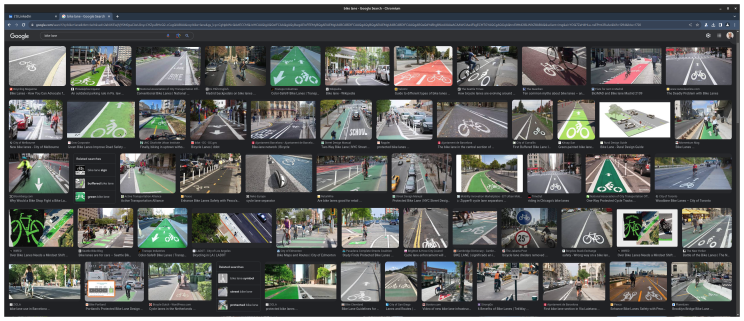

  

# The problem with bike lanes in my town

Another long rant incoming! I am going to start a platform to fix the world 😂

## Background

A new bicycle lane was inaugurated in my town of Rivas-Vaciamadrid roughly a year ago. I love riding my bicycle, so this should have been great news, right? Well, not at all!

Here is how it looks from above (Google Maps hasn't updated the satellite view yet, so my diagram should suffice):

Yes, **the bike lanes run through the center of the road** instead of along the sides. Some might argue that it's merely a cosmetic difference and that as long as it serves its purpose, all is well. However, this seemingly minor change can have a significant impact on the bike lane's usability.

The first glaring flaw that you can notice, even before you hop on your bicycle, is that now, **in every roundabout, a cyclist must interact with motor traffic two more times than necessary**. Even for a simple right turn, you must cross from the inside to the outside, placing yourself in front of cars merging into the roundabout from your lane, and then cross from the outside to the inside, putting yourself in front of cars exiting the roundabout.

There's a second, more subtle nuance that I didn't notice until I was riding: **the turning radius when entering and exiting the roundabouts is very tight**. The way the lines are drawn, there isn't a smooth curve that allows for easy entry and exit from the roundabout.

These tight corners force you to slow down almost completely, or veer out of the designated lane and invade the area reserved for cars.

It keeps getting worse...

Being in the middle of the road also means you're **surrounded by cars on both sides**. You don't need to be an expert in *fluid dynamics* to notice that the density of **exhaust fumes** decreases faster the farther away you move from the source (if you want to get technical, the model is called Gaussian difussion). Thus, being sandwiched between traffic can expose you to nearly **twice as much air pollution** as riding along the side of the road.

There's another hazard related to randomly moving particles, which only becomes apparent during autumn: **fallen leaves**!

Cars randomly disperse leaves in various directions as they pass by, until they settle where no forces are moving them. As the bike lane is separated from the rest of the traffic, it becomes a natural gathering place for leaves, creating a dangerously **slippery surface** when they are wet.

This brings us to the next issue: the physical lane dividers.

These dividers are problematic by themselves. They **won't stop a car** from getting into the bicycle lane, yet they can certainly cause a cyclist (or motorcyclist) to **lose control** if their tires graze them.

They also pose an additional danger if you happen to fall near one of them. Hitting your head against a flat surface is bad enough, but any protrusion increases the **risk of a neck injury**.

These dividers are made of hard plastic that can break when a car collides with them, leaving two **exposed steel bolts**, which are even more dangerous than the chunk of plastic itself. This also raises concerns about maintenance. As we know, metals have a different expansion coefficient than asphalt, so it's inevitable that they will eventually **crack the road as temperatures fluctuate**, allowing water to penetrate and further degrading safety for all road users.

There's another side effect of having both directions of traffic share the central lane:

On a steep street, two things happen: downhill cyclists **pick up speed**, and uphill cyclists naturally **wiggle** to fight the gradient. When these two things occur in a confined space, **collisions** between cyclists are likely to happen.

The last problem I can think of is how to get in or out of the bike lane safely. **When you have arrived to your destination, you need to cross the traffic to exit the road**, putting yourself in danger once more.

To add insult to injury, **there was already a perfectly fine segregated bike lane** that traversed most of the existing layout. It has now been repurposed for pedestrians, despite the presence of usable sidewalks and even a dirt path ideal for jogging situated right beside it.

All of these grievances are shared from the perspective of a *cyclist*. However, **car drivers are even more exasperated** by the new bike lane arrangement, as it resulted in a reduction of car lanes from two to one on most streets... And it's not just taking one lane away: they are creating a **choke point** because with the segregated bicycle lane in the middle of the road, now it's impossible to temporarily use the opposite lane to overcome an obstruction in your lane.

Consequently, **traffic jams** have become more commonplace.

## The cause

You don't need to be a genius to notice any of these issues (well, maybe the air pollution was not too obvious); you just need to pay attention, or better yet, **take a test ride** after the first section is finished, before committing to constructing over 20 kilometers of bike lanes.

There's a glaring hint as to why this wasn't a brilliant idea: **in nearly every other city in the world, bike lanes are situated on the side of the road**, not in the center. You don't even have to travel to grasp this concept. A simple Google Images search for "bike lane" can show you the standard design from the comfort of your home.

So, it's quite evident to me what the root cause of the problem is: **the individuals responsible for this mess simply didn't care**. They weren't going to use the bike lanes, and it wasn't their money on the line, so why should they?

## The solution

I learned all these concepts from studying and practicing Software Engineering, but they've been borrowed from various other industries long before computers were commonplace:

1. **Research**: Do not waste resources reinventing the wheel, or trying to square the circle. Have similar projects already been tackled before? What were the outcomes?

1. **Identify the Stakeholders**: Collaboration with stakeholders to define project requirements is essential. In the case of public infrastructure like bike lanes, riders, drivers, and pedestrians should have been considered from the outset.

1. **Gather Continuous Feedback**: It's critical to collect feedback throughout the project's lifecycle. The more advanced a project becomes, the costlier it is to correct flaws. As an example, the [initial batch of dividers that ended up in the landfill](https://www.diarioderivas.es/bolardos-carril-bici-rivas/).

1. **Define Success Metrics**: Success should be quantifiable. Are more people using their bicycles? Are commute times shorter? Are there fewer accidents? Are citizens leading healthier lives due to improved infrastructure?

1. **Accountability**: Accountability is a hallmark of the private sector. If you make a mistake, you bear the consequences, potentially even going bankrupt. In public services it's harder (and sometimes impossible) to keep people accountable, because election cycles are long (who's going to remember this in 4 years?), there's no granularity (you can't punish a bad decision in isolation), and maybe there are no good alternatives at all.

To be absolutely fair, there was one advantage of putting the bicycle lane in the middle: cars won't open their doors on you (well, they still might).
